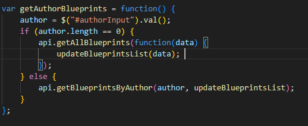

# lab6_front_Arsw

## HECHO POR: JUAN PABLO FERNANDEZ

Primera parte 

Para la primera parte tuve que corregir las dependecias ya que una de estas no contaba con la version por lo que estaba dando fallos

Posteriormente tuve que agregar los directorios necesarios para contener los archivos js y html

Ahora tendremos que colocar el encabezado para poder usar librerias para la facilitacion de diseño front

Despues de colocar todo ejecutamos el proyecto y no deberia aparecer ningun error. 

Para ejecutar el proyecto es necesario colocar el siguiente comando:

## mvn spring-boot:run

Abrimos este link

http://localhost:8080/index.html

## Fron-End - Logica

Creando el modulo de javascrit app.js

Posterior a eso tendremos que colocar las respectivas importaciones en el html 

 ## 
 ## 

 Se nos pide que el modulo antes creado mantenga de manera privdad el nombre del autor seleccionado 

Como podemos ver aqui por medio de la declaracion de variables dentro de la estrucutra modulo de javascript

y cada objeto es independiente del otro, autor, puntos, nombre del plano.

