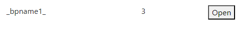
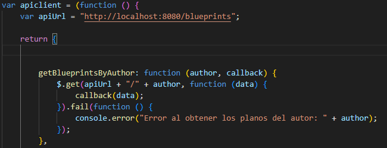

# lab6_front_Arsw

## HECHO POR: JUAN PABLO FERNANDEZ

Primera parte 

Para la primera parte tuve que corregir las dependecias ya que una de estas no contaba con la version por lo que estaba dando fallos

Posteriormente tuve que agregar los directorios necesarios para contener los archivos js y html

Ahora tendremos que colocar el encabezado para poder usar librerias para la facilitacion de diseño front

Despues de colocar todo ejecutamos el proyecto y no deberia aparecer ningun error. 

Para ejecutar el proyecto es necesario colocar el siguiente comando:

## mvn spring-boot:run

Abrimos este link

http://localhost:8080/index.html

## Fron-End - Logica

Creando el modulo de javascrit app.js

Posterior a eso tendremos que colocar las respectivas importaciones en el html 

 ## 
 ## 

 Se nos pide que el modulo antes creado mantenga de manera privdad el nombre del autor seleccionado 

Como podemos ver aqui por medio de la declaracion de variables dentro de la estrucutra modulo de javascript

y cada objeto es independiente del otro, autor, puntos, nombre del plano.

Acontinuacion tambien veremos la funcion que permite encontrar los blueprints correspondientes a cada autor usando el nombre del autor.

## Punto 5 

Para el siguiente punto tendremos que coloar en el app.js una operacion publica que permita obtener los blueprints por medio del autor. haciendo uso del 
modulo proporcionado como apimock y por medio de funciones callback

Este se realizo de la siguiente manera

Como podemos ver dentro de esa misma funcion se calcula la cantidad de puntos que ese plano tiene.

y dicha operacion tambien ya esta asociada al boton anteriormente creado

## Punto 8, 9, 10 , 11 y 12 

Ahora tendremos que por medio de un canvas poder graficar los puntos correspondientes a ese plano. 

como podemos ver ya el canvas fue creado ahora tendremos que colocar la opcion para poderlo graficar.

listo ahora tendremos que probar si clickeando en este punto podremos graficarlo
                    
                               

                    

Como podemos ver aqui el blueprint fue graficado correctamente 

## Punto 12
Ahora tendremos que hacer un modulo apiclient.js para que este modulo haga uso de los datos que la API REST contiene por medio de peticiones GET

## Punto 13
Ahora tendremos que por medio de peticiones conecte con la API REST y obtenga la informacion correpondiente. Eso se puede ver en la siguiente imagen

## ---------------- Parte 2---------------------

## Punto 1 Y 2
Ahora tendremos que hacer que por medio del click sea posible hacer nuevos puntos dentro del plano. Para esto tenemos
las sigueintes funciones dentro del app.js 

Estas funciones estan encargadas de pintar cada uno de los puntos que se clickeen o sea tapeen dentro de el. SIN aun mandarlas a la API

## Punto 3 

Se debe agregar un boton para poder guardar los puntos dentro del blueprint 

# Cabe resaltar que para cada uno de estos puntos para peticiones put y post fue necesario adecuar cada una de las capas de la API REST para recibir dichas peticiones 

Ahora tengdremo que hacer la peticion tendremos que hacer uso de .ajax

de la siguiente manera.

## Punto 4

Para este punto no me fue posible crear un nuevo blueprint sin embargo, la API y la app esta complemtanente adecuada para dicha peticion. Sin embargo, aun no logre crear un nuevo blueprint.

## Punto 5

Por ultimo tendremos La peticion de borrar o DELETE para esto tendremos que adecuar dicha funcionalidad en cada una de las capas de la aplicacion spring boot

Dichas muestras se encontraran en los controladores para recibir las peticiones, capa de servicios para hacer logica de negocio y por ultimo capa de persistencia para mantener la informacion que por ahora tenemos guardada.

como podemos ver se borro un blueprint oprimiendo el boton Delete y tambien lo actuliza de una vez